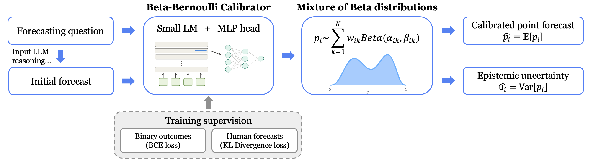

# Aligning LLMs with Human Uncertainty: A Beta-Bernoulli Calibrator for LLM Forecasting


Beta-Bernoulli Calibrator (BBC) is a lightweight, model-agnostic post-hoc calibrator that converts an LLM's verbalized point forecast into a mixture of Beta distributions over the latent event probability, trained on both binary outcomes and aggregated human forecasts:

```
event probability    p ~ Σ_k w_k · Beta(α_k, β_k)
binary outcome       y ~ Bernoulli(p)
calibrated forecast  p̂ = E[p]
epistemic uncertainty  û = Var[p]
```
<p align="center">
  
</p>

## Setup

```bash
git clone git@github.com:agentic-learning-ai-lab/beta-bernoulli-calibrator.git
cd beta-bernoulli-calibrator

conda create -n bbc python -y
conda activate bbc
pip install -r requirements.txt
```

## Usage

### 1. Initial forecast

Initial forecasts serve as the verbalized baseline in the paper, and also as the input for the calibration methods (including BBC, Platt Scaling, and Isotonic Regression).

**a) Generate:** `verbalized/generate.py` prompts an input LLM (specified in `--model_name`) for a verbalized probability on each forecasting question.

```bash
python verbalized/generate.py --model_name qwen3-8b \
    --input_path data/default/test.json \
    --output_path results/default/verbalized
```

**b) Process:** `verbalized/process.py` parses the raw text into a `prob` / `rationale` / structured-`response` schema for the training and baseline scripts in later steps.

```bash
python verbalized/process.py \
    --input  results/default/verbalized/qwen3-8b/test_raw.json \
    --output results/default/verbalized/qwen3-8b/test.json
```

### 2. Beta-Bernoulli Calibrator

BBC is a LoRA-adapted small LLM with a mixture-of-Beta head. Notable training arguments:

- `--net`: the calibrator backbone LLM.
- `--n_models`: number of Beta mixture components (K).
- `--binary_coeff` / `--human_coeff`: loss is `--binary_coeff` × binary-outcome NLL + `--human_coeff` × KL to the human forecast histogram; set `--human_coeff 0` for the binary-only setting.
- `--lr`: learning rate.
- `--lora_rank`: LoRA rank.
- `--output`: output directory to save the trained checkpoint and prediction files.

```bash
python bbc/train.py \
    --train_path results/default/verbalized/claude-4-sonnet/train.json \
    --val_path results/default/verbalized/claude-4-sonnet/val.json \
    --test_path results/default/verbalized/claude-4-sonnet/test.json \
    --net meta-llama/Llama-3.2-1B \
    --binary_coeff 1 \
    --human_coeff 1 \
    --lr 1e-6 \
    --lora_rank 256 \
    --n_models 5 \
    --output results/default/bbc/out_llama3_2-1b/in_claude-4-sonnet/run0
```

To do inference, run a trained checkpoint to a verbalized JSON with `bbc/infer.py` (`--model_dir` points to a directory produced by `bbc/train.py`):

```bash
python bbc/infer.py \
    --model_dir results/default/bbc/out_llama3_2-1b/in_claude-4-sonnet/run0 \
    --test_path results/default/verbalized/claude-4-sonnet/test.json \
    --output_path results/default/bbc/out_llama3_2-1b/in_claude-4-sonnet/run0/test_with_preds.json
```

### 3. Baselines

Baseline methods used in the paper:

- **Ensemble**: `verbalized/generate.py --mode ensemble` samples n forecasts at temperature 1.0, and `verbalized/process.py` processes them.
- **P(True)**: `baselines/ptrue.py` reads the model's own yes/no next-token probability (for whitebox input LLMs).
- **Platt Scaling**: `baselines/platt.py`, a parametric post-hoc calibrator.
- **Isotonic Regression**: `baselines/isotonic.py`, a non-parametric post-hoc calibrator.


```bash
# Ensemble
python verbalized/generate.py \
    --mode ensemble \
    --model_name qwen3-8b \
    --input_path data/default/test.json \
    --output_path results/default/ensemble \
    --n_samples 10 \
    --temperature 1.0

python verbalized/process.py \
    --input  results/default/ensemble/qwen3-8b/test_raw.json \
    --output results/default/ensemble/qwen3-8b/test.json

# P(True)
python baselines/ptrue.py \
    --model_name qwen3-8b \
    --mode rationale \
    --input_path data/default/test.json \
    --output_path results/default/ptrue

# Platt Scaling
python baselines/platt.py \
    --train_data results/default/verbalized/qwen3-8b/train.json \
    --val_data   results/default/verbalized/qwen3-8b/val.json \
    --target_data results/default/verbalized/qwen3-8b/test.json \
    --output_dir results/default/platt/qwen3-8b \
    --method platt

# Isotonic Regression
python baselines/isotonic.py \
    --train_data results/default/verbalized/qwen3-8b/train.json \
    --val_data   results/default/verbalized/qwen3-8b/val.json \
    --target_data results/default/verbalized/qwen3-8b/test.json \
    --output_dir results/default/isotonic/qwen3-8b
```

## Reproducing the paper

To reproduce the paper's main results, follow the steps in `examples/`.

```bash
bash examples/step1_init_forecast.sh   # verbalized forecasts (train/val/test)
bash examples/step2_bbc.sh             # train BBC
bash examples/step3_baselines.sh       # ensemble / P(True) / Platt / Isotonic / fine-tuned forecasters
bash examples/step4_analysis.sh        # main table (stdout) + figures
```

Outputs will be in `results/default/<method>/<input_model>/...`, where the analysis scripts (`analysis/main_table.py`, `reliability_diagram.py`, `uncertainty_plot.py`) read them to produce Table 1 and the figures.

## Data

`data/default/{train,val,test}.json`: Metaculus + Polymarket data split by question resolution date: train before 2025-04-01 (7,824), val before 2025-08-01 (1,917), and test between 2025-08-01 and 2026-01-14 (1,614). The test window is beyond every input LLM's knowledge cutoff. Slimmed to:

```
question, resolution_criteria, open_date, close_date,
resolve_date, resolution, forecast_histogram, source, category
```